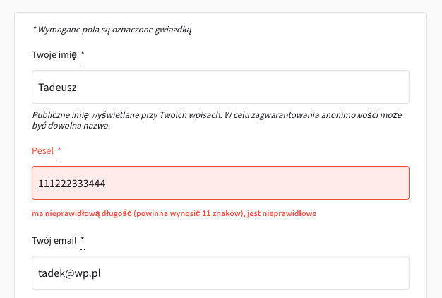
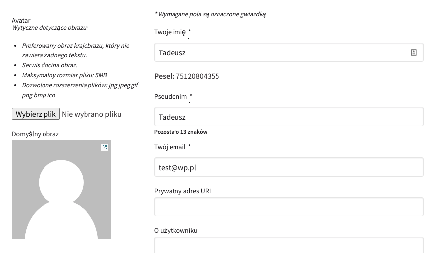

# Registation with pesel

Added new field `pesel` in registration form




Added preview of field `pesel` in user profile



---

Migration creating `pesel` column in `decidim_users` was added. It has unique index for fast fetching.

It's located in [db/migrate/20201212112736_add_pesel_to_users.rb](https://github.com/Boberkraft/decidim/blob/master/db/migrate/20201212112736_add_pesel_to_users.rb). 

When applied, the schema compared to freshly generated app changes in the following way:


```bash
diff --git a/db/schema.rb b/db/schema.rb
index 0db994a..710aa70 100644
--- a/db/schema.rb
+++ b/db/schema.rb
@@ -10,7 +10,7 @@
 #
 # It's strongly recommended that you check this file into your version control system.
 
-ActiveRecord::Schema.define(version: 2020_09_07_111079) do
+ActiveRecord::Schema.define(version: 2020_12_12_112736) do
 
   # These are extensions that must be enabled in order to support this database
   enable_extension "ltree"
@@ -1593,6 +1593,7 @@ ActiveRecord::Schema.define(version: 2020_09_07_111079) do
     t.datetime "admin_terms_accepted_at"
     t.string "session_token"
     t.string "direct_message_types", default: "all", null: false
+    t.string "pesel"
     t.index ["confirmation_token"], name: "index_decidim_users_on_confirmation_token", unique: true
     t.index ["decidim_organization_id"], name: "index_decidim_users_on_decidim_organization_id"
     t.index ["email", "decidim_organization_id"], name: "index_decidim_users_on_email_and_decidim_organization_id", unique: true, where: "((deleted_at IS NULL) AND (managed = false) AND ((type)::text = 'Decidim::User'::text))"
@@ -1603,6 +1604,7 @@ ActiveRecord::Schema.define(version: 2020_09_07_111079) do
     t.index ["invited_by_id"], name: "index_decidim_users_on_invited_by_id"
     t.index ["nickname", "decidim_organization_id"], name: "index_decidim_users_on_nickame_and_decidim_organization_id", unique: true, where: "((deleted_at IS NULL) AND (managed = false))"
     t.index ["officialized_at"], name: "index_decidim_users_on_officialized_at"
+    t.index ["pesel"], name: "index_decidim_users_on_pesel", unique: true
     t.index ["reset_password_token"], name: "index_decidim_users_on_reset_password_token", unique: true
     t.index ["unlock_token"], name: "index_decidim_users_on_unlock_token", unique: true
   end
```

Because Decidim is using registration modules from `Devise`, an overridden of its templates was neccesery.

To allow passing values to the server, inside the registration form (`views/decidim/devise/registrations/new`) the following field was added:
```html
 <div class="field">
   <%= f.text_field :pesel %>
 </div>
```

Additionally, the verification object `Decidim::RegistrationForm`, was overridden, to allow accessing the new field.
Accesor for it was added: `attribute :pesel, String`.

And also verification of correctnes inside user model via `Decidim::User#validate_pesel`.


## Pesel verification:

PESEL (en. Universal Electronic System for Registration of the Population) is the national identification number used in Poland.

Two types of validations of pesel occur inside the application.
### Length
Lenght of pesel is implemented using `ActiveModel::Validations::PresenceValidator` which adds specialized error message when to toe object when it detects anomalym.

### Pesel  
Control sum checking and pesel validation is delegated to the externals library under the MIT license https://github.com/macuk/pesel. It is well tested and works well, so there is no need for addidional work.

