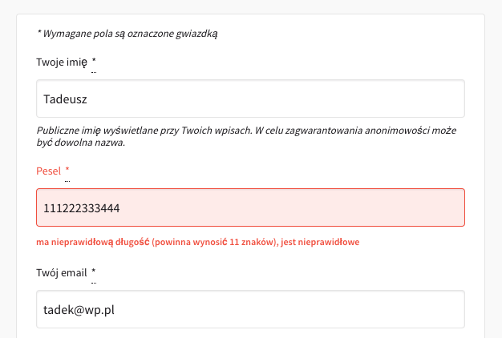
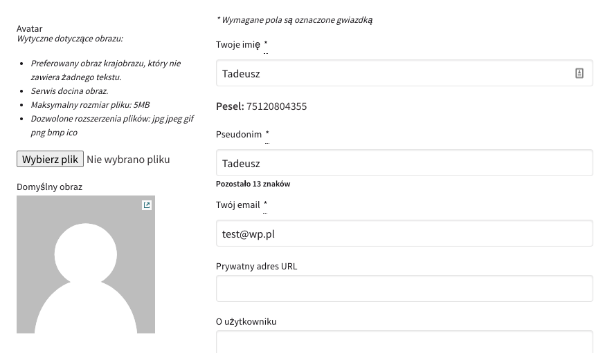

# Rejestracja z numerem pesel

Dodano dodatkowe pole `pesel` w formulatrzu rejestracyjnym:



Dodano podgląd pola `pesel` w profilu:



---

Stworzona została migracja dodająca kolumnę `pesel` do tabeli uzytkowników systemu `Decidim`. By przyśpieszyć kwerendy z jej udziałem, została ona opatrzona unikalnym indeksem.

Znajduje się ona w pliku [db/migrate/20201212112736_add_pesel_to_users.rb](https://github.com/Boberkraft/decidim/blob/master/db/migrate/20201212112736_add_pesel_to_users.rb). 

Po jej zaaplikowaniu, schema, w porównaniu z świezo wygenerowaną aplikacją, zmienia się w następujący sposób:

```bash
diff --git a/db/schema.rb b/db/schema.rb
index 0db994a..710aa70 100644
--- a/db/schema.rb
+++ b/db/schema.rb
@@ -10,7 +10,7 @@
 #
 # It's strongly recommended that you check this file into your version control system.
 
-ActiveRecord::Schema.define(version: 2020_09_07_111079) do
+ActiveRecord::Schema.define(version: 2020_12_12_112736) do
 
   # These are extensions that must be enabled in order to support this database
   enable_extension "ltree"
@@ -1593,6 +1593,7 @@ ActiveRecord::Schema.define(version: 2020_09_07_111079) do
     t.datetime "admin_terms_accepted_at"
     t.string "session_token"
     t.string "direct_message_types", default: "all", null: false
+    t.string "pesel"
     t.index ["confirmation_token"], name: "index_decidim_users_on_confirmation_token", unique: true
     t.index ["decidim_organization_id"], name: "index_decidim_users_on_decidim_organization_id"
     t.index ["email", "decidim_organization_id"], name: "index_decidim_users_on_email_and_decidim_organization_id", unique: true, where: "((deleted_at IS NULL) AND (managed = false) AND ((type)::text = 'Decidim::User'::text))"
@@ -1603,6 +1604,7 @@ ActiveRecord::Schema.define(version: 2020_09_07_111079) do
     t.index ["invited_by_id"], name: "index_decidim_users_on_invited_by_id"
     t.index ["nickname", "decidim_organization_id"], name: "index_decidim_users_on_nickame_and_decidim_organization_id", unique: true, where: "((deleted_at IS NULL) AND (managed = false))"
     t.index ["officialized_at"], name: "index_decidim_users_on_officialized_at"
+    t.index ["pesel"], name: "index_decidim_users_on_pesel", unique: true
     t.index ["reset_password_token"], name: "index_decidim_users_on_reset_password_token", unique: true
     t.index ["unlock_token"], name: "index_decidim_users_on_unlock_token", unique: true
   end
```

Opierając się na scheme, zmodyfikowany został formularz rejestracyjny `Devise` dodając nowe pole `pesel`, którego wartość  będzie przesyłana do serwera w celu weryfikacji.

```html
 <div class="field">
   <%= f.text_field :pesel %>
 </div>
```

Został zmieniony obiekt weryfikujący `Decidim::RegistrationForm`, tak by wspierał nowy atrybut.
Doszedł accessor atrybutu `attribute :pesel, String`.

Następuje również sprawdzanie poprawności peselu w formularzu i w modelu użytkownika (`Decidim::User`) w 
`#validate_pesel`.

## Rodzaje walidacji peselu:

Numer PESEL jest to 11 cyfrowy identyfikator numeryczny jednoznacznie identyfikujący określoną osobę fizyczną.

Do przykładowej aplikacji zostały dodane dwie walidacje:
### Liczba znaków
Zaimplementowane zostało sprawdzanie liczby znaków peselu przy pomocy specjalistycznego walidatora `ActiveModel::Validations::PresenceValidator`, który w przypadku wykrycia nieprawidłowości automatycznie dodaje konkretyn błąd, że liczba znaków powinna wynosić dokładnie 11. 
### Poprawność Peselu

Przetwarzanie cyfry kontrolnej i sprawdzanie poprawności zostaje oddelegowanie do zewnętrzen biblioteki na licencji MIT https://github.com/macuk/pesel. Jest ona dobrze przetestowana kompletna, więc nie ma sensu tworzenie własnego modułu. 


## Internacjonalizacja

Wszystkie błędy wygnerowane przez nowy kod są tłumaczone na aktualny język, przy pomocy systemu walidacji Rails. 
